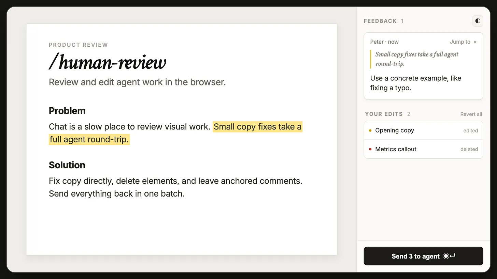

# Human Review

Review HTML, Markdown and localhost pages in a browser, edit text, leave comments
and send the feedback to your coding agent. This folder contains the maintained
skill and its complete Node runtime, based on
[Peter Yang's Human Review](https://github.com/petergyang/human-review).



## Install

Requires Node.js 20 or newer. Use Node.js 24 or newer to run the development tests.

From this folder:

```sh
npm ci
node scripts/install-local.mjs
```

The installer creates `~/.local/bin/human-review` pointing to this folder and
links it into `~/.claude/skills/`, `~/.codex/skills/` and `~/.agents/skills/`.
Keep this checkout in place after installation. If you move it, rerun the
installer from its new location. Existing skill folders and the previous managed
command are backed up under `~/.local/state/human-review/skill-backups/`, outside
the skill directories so agents do not discover the backups as duplicate skills.

Reinstalling is safe: links that already point here are kept, and setup does not
rewrite the canonical skill through those links.

## Open a review

In Claude Code:

```text
/human-review path/to/file.md
```

In Codex, invoke `$human-review` with the file or localhost URL. From a terminal:

```sh
~/.local/bin/human-review path/to/file.html
~/.local/bin/human-review http://localhost:3000/page
```

Click Send to deliver your edits and comments. Claude Code can receive feedback
while its agent waits in the background. Codex waits during an active turn; if
the turn has already ended, message the agent to pick up the saved feedback.
[SKILL.md](SKILL.md) contains the agent's review loop and feedback handling rules.

### Comment completion

Sent means feedback was submitted. Text changed means its original quote is no
longer found after a rewrite. Once the agent applies every item, it confirms the
batch without starting another wait:

```sh
~/.local/bin/human-review ack path/to/file.html
```

Applied comments move into the collapsed **Completed** history. It keeps the
latest 50 comments across restarts; they do not count as active feedback or ship
again. New comments and edits made while the agent was working remain pending.
`poll --ack` also confirms completion before waiting for the next batch.

## Review tools

- Edit and Read modes, formatting controls, lists, undo and redo.
- Find in the rendered document, with next and previous matches.
- Select text or click an element to comment; the comment field focuses immediately.
- Capture a selected area, the viewport or the full page.
- Draw red pencil strokes or dots, undo or clear them, and include them in captures.
- Upload a PNG or JPEG and attach it to a comment.
- Send with Cmd/Ctrl+Enter; start area capture with Cmd/Ctrl+Shift+S.

Drawings are temporary overlays and never become source edits. Capture them
before reloading. Screenshots are delivered to the agent as temporary local
files; copy an attachment before acknowledging feedback if it should be retained.

Plain HTML edits autosave. Markdown and localhost edits go to the agent, which
applies them to the source. Closing a review preserves unsent feedback for the
next open.

## Runtime health

```sh
~/.local/bin/human-review doctor
~/.local/bin/human-review stop
```

Doctor reports server memory, sessions, connections, polls and file watchers
without starting a server. Stop releases the server while retaining feedback.
Servers without clients or polls exit after five minutes. Screenshot size,
drawing history and feedback counts are bounded.

See [LOCAL_CHANGES.md](LOCAL_CHANGES.md) for the resource fixes, capture limits
and measured development results. The originally reported multi-GB process was
already gone during the investigation, so its cause remains unconfirmed.

## Development

```sh
npm test
```

The runtime lives in `src/`, the installer in `scripts/`, and regression tests in
`test/`. Dependencies, review state, backups and verification artifacts are
ignored by Git. This checkout is marked private to avoid publishing the maintained
variant as the upstream npm package.

## License

**Original creator: Peter Yang.** Original project:
[github.com/petergyang/human-review](https://github.com/petergyang/human-review).
This copy includes locally maintained improvements.
Distributed under the original MIT license, with Peter Yang's copyright retained
unchanged in [LICENSE](LICENSE).
